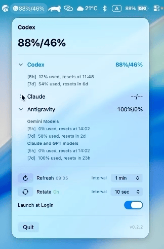
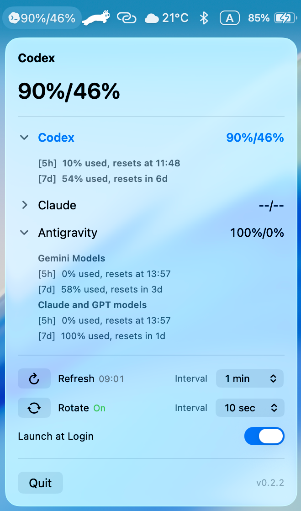

[English](./README.md) | [한국어](./README.ko.md)

# codex-opero

`codex-opero`는 macOS 메뉴 막대에서 AI 사용량을 `57%/90%`처럼 바로 보여주는 작은 앱입니다.  
복잡한 대시보드 대신, 지금 필요한 숫자만 빠르게 확인하는 데 초점을 두었습니다.

<table width="100%">
  <tr>
    <td width="50%" valign="top"></td>
    <td width="50%" valign="top" align="center"></td>
  </tr>
  <tr>
    <td width="50%" valign="top"></td>
    <td width="50%" valign="top"></td>
  </tr>
</table>

## 핵심 기능

- 메뉴 막대에 선택된 provider의 남은 사용량을 두 칸 숫자 형식으로 간단히 표시합니다
- `Codex`, `Claude`, `Antigravity` 중 하나를 선택해서 메뉴 막대에 띄울 수 있습니다
- 메뉴 막대와 provider 행의 compact 숫자를 잔여량 또는 사용량으로 전환할 수 있습니다
- 마지막으로 선택한 provider를 기억합니다
- `Auto Rotate`를 켜면 사용 가능한 provider를 설정한 간격으로 자동 순환합니다
- 메뉴에서 refresh 간격을 프리셋으로 선택할 수 있습니다
- 메뉴에서 auto rotate 간격을 프리셋으로 선택할 수 있습니다
- 메뉴 하단에서 현재 설치된 앱 버전을 확인하고, 새 버전이 있으면 GitHub Release로 이동할 수 있습니다
- 설정한 간격으로 자동 새로고침하며, `Refresh Now`도 지원합니다
- 느린 provider의 조회가 끝나기를 기다리지 않고, 조회가 끝난 provider부터 바로 표시합니다
- 중요한 사용량 구간이 다시 `100%`가 되면 macOS 알림으로 알려줍니다
- 마지막 성공 확인 후 24시간마다 GitHub 릴리즈 업데이트를 확인합니다
- 패키징된 `.app`에서는 `Launch at Login` 토글을 사용할 수 있습니다
- 조회에 실패하면 `--/--`로 표시합니다

## 인증 방식

이 앱은 별도 로그인 UI나 OAuth 화면을 만들지 않습니다.  
대신 이미 로컬에 저장된 인증 상태를 재사용해 usage만 조회합니다.

- `Codex`: `~/.codex/auth.json` 사용
- `Claude`: macOS Keychain의 `Claude Code-credentials` 또는 `~/.claude/.credentials.json` 사용
- `Antigravity` (agy): 실행 중인 Antigravity IDE의 로컬 서비스에서만 model quota를 읽습니다. 기존 Antigravity 로그인 상태가 필요합니다

즉, 이 앱은 이미 로그인된 상태를 활용하므로 Codex, Claude 또는 Antigravity에 로그인 되어 있어야 합니다.

[Google 공식 정책](https://docs.cloud.google.com/gemini/docs/codeassist/release-notes)에 따라 2026년 6월 18일부터 개인용, Google AI Pro, Google AI Ultra의 Gemini CLI 요청 처리가 중단되어 독립 Gemini provider는 제거했습니다. 개인 사용자의 Gemini 모델 quota는 Antigravity에서 확인할 수 있습니다.

`Antigravity`의 경우 메뉴 막대의 두 칸 숫자는 두 공유 모델 그룹의 5시간 잔여 quota를 표시합니다. 단, 해당 그룹의 주간 quota를 모두 소진하면 5시간 quota가 남아 있더라도 `0%`로 표시합니다.

- `Gemini Models`: Gemini Flash 및 Gemini Pro 계열
- `Claude and GPT models`: Claude Opus/Sonnet 및 GPT-OSS 계열

provider 상세 영역을 열면 각 그룹의 `[5h]`, `[7d]` 행을 5시간 구간부터 간결하게 확인할 수 있습니다. `codex-opero`는 현재 Model Quota 화면과 같은 데이터 소스인 Antigravity 로컬 `RetrieveUserQuotaSummary` service를 조회하며, 이전 버전 호환을 위해 기존 모델별 endpoint도 fallback으로 유지합니다. 안전을 위해 백그라운드에서 `agy`를 자동 실행하지 않습니다. 반복적인 CLI 실행은 인증 흐름을 시작하거나 IDE workspace 항목을 만들 수 있습니다. Antigravity 사용량을 조회할 때에는 Antigravity 앱을 실행해두어야 하며, 로컬 service를 사용할 수 없으면 `agy`를 실행하거나 오래된 cache 값을 표시하는 대신 명확한 안내 메시지를 표시합니다.

`[5h]` 행의 리셋 시간은 `resets at 오후 2:18`처럼 macOS의 시간 형식에 맞춰 분 단위의 정확한 시각으로 표시합니다. `[7d]` 등 나머지 구간은 기존의 간결한 상대시간 표시를 유지합니다.

`Claude`를 사용하는 경우, 앱이 처음 Keychain 자격증명에 접근할 때 macOS가 암호를 물어볼 수 있습니다.
이 팝업은 **사용자가 해당 AI 도구를 로그인하여 사용하고 있으며, 관련 키체인이 존재할 때만 1회** 나타납니다. (해당 AI 도구를 전혀 사용하지 않거나 로그인한 적이 없는 경우 팝업은 전혀 발생하지 않고 자동으로 스킵됩니다.)  

`codex-opero`는 일정 간격으로 새로고침하므로, 팝업창이 뜰 때 `허용` 대신 **`항상 허용(Always Allow)`**을 선택하셔야 이후 비밀번호 요구 없이 백그라운드에서 매끄럽게 조회됩니다.

<p>
  
</p>

이 대화상자가 뜨면 **`항상 허용`**을 선택하세요. 그래야 `codex-opero`가 백그라운드에서 사용량을 새로고침할 때마다 비밀번호를 다시 묻지 않습니다.

## 알림

`codex-opero`는 사용량이 다시 회복되었을 때 macOS 알림으로 알려줄 수 있습니다.

- `Codex`, `Claude`: `5h` 또는 `7d` 남은 사용량이 `100%`로 돌아오면 알림을 보냅니다
- `Antigravity`: `Gemini Models` 또는 `Claude and GPT models` 그룹의 사용 가능량이 `100%`로 돌아오면 알림을 보냅니다

각 구간은 `100%` 상태가 유지되는 동안 한 번만 알림을 보냅니다.  
사용량이 `100%` 아래로 내려갔다가 다시 `100%`로 돌아오면 다시 알림을 보낼 수 있습니다.

또한 마지막으로 성공한 확인 시점부터 24시간마다 GitHub Releases를 확인합니다. 확인 예정 시각에 Mac이나 앱이 꺼져 있었다면 다음 앱 실행 때 즉시 확인합니다.
새 버전이 있으면 메뉴 하단의 버전 표시가 `v0.2.1 → v0.2.2`처럼 바뀌고 부드럽게 밝아졌다 흐려집니다. 이 링크를 클릭하면 해당 GitHub Release 페이지를 엽니다. macOS에서 동작 줄이기를 사용하면 애니메이션 없이 정적으로 표시합니다.

## Auto Rotate

`Auto Rotate`는 기본값이 꺼져 있습니다.  
켜면 아래 순서대로 사용 가능한 provider를 자동 순환합니다.

- `Codex`
- `Claude`
- `Antigravity`

refresh 간격은 `1분`, `3분`, `5분`, `15분` 같은 프리셋 중에서 고를 수 있습니다.  
auto rotate 간격도 `10초`, `30초`, `60초` 같은 프리셋 중에서 고를 수 있습니다.

현재 `--/--`로 표시되는 조회 실패 provider는 자동으로 건너뜁니다.  
메뉴가 열려 있는 동안에는 순환이 잠시 멈추고, 메뉴를 닫으면 다시 이어집니다.  
새로고침 중에는 마지막 성공 스냅샷을 계속 보여주고, 실제로 refresh가 실패한 경우에만 `--/--`로 fallback합니다.
최초 실행 시에도 각 provider는 조회가 끝나는 즉시 표시되며, 가장 먼저 성공한 provider가 메뉴 막대에 먼저 표시되는 동안 느린 provider는 계속 조회됩니다.

## 릴리즈에서 설치

일반 사용자는 GitHub 릴리즈에서 `.dmg`를 내려받아 설치하는 방식이 가장 편합니다.

1. [Releases](https://github.com/charliehotel/codex-opero/releases)에서 최신 `.dmg`를 다운로드합니다
2. `.dmg`를 엽니다
3. `codex-opero.app`를 `Applications` 폴더로 드래그합니다
4. `Applications` 폴더에서 `codex-opero.app`를 실행합니다

## macOS가 실행을 막을 때

현재 배포되는 `codex-opero`는 로컬 사용을 위한 ad-hoc 서명이 적용되지만, Apple Developer ID 서명이나 notarization은 적용되지 않습니다.
macOS가 실행을 막으면 아래 방법 중 하나를 사용하실 수 있습니다.
(이 방법은 직접 빌드했거나, 출처를 신뢰할 수 있는 앱에만 사용하시는 것을 권장드립니다.)

### 방법 1. Finder에서 열기

1. `codex-opero.app`를 우클릭합니다.
2. `열기`를 선택합니다.
3. 경고가 나오면 다시 한 번 `열기`를 선택합니다.

### 방법 2. quarantine 속성 제거

```bash
xattr -dr com.apple.quarantine /Applications/codex-opero.app
open /Applications/codex-opero.app
```

## 소스에서 빠르게 실행

```bash
git clone https://github.com/charliehotel/codex-opero.git
cd codex-opero
swift run codex-opero
```

macOS 환경과 로컬의 기존 Codex, Claude 또는 Antigravity 로그인 상태가 필요합니다.

## 릴리즈 노트

<details>
  <summary>v0.2.5</summary>
  <ul>
    <li>Codex가 통합 ChatGPT 데스크톱 앱으로 합쳐지며 발생하던 사용량 디코딩 실패 문제 수정</li>
    <li>한시적으로 누락된 5시간 쿼터 데이터를 <code>nil</code>로 두어 화면에 <code>--</code>로 대응하도록 개선 (추후 복원 시 코드 수정 없이 자동 동기화)</li>
  </ul>
</details>

<details>
  <summary>v0.2.4</summary>
  <ul>
    <li>새 버전이 있을 때 파란색 하단 업데이트 링크만 펄스하도록 수정</li>
    <li>업데이트 링크가 펄스하는 동안에도 메뉴 패널은 고정되고 클릭할 수 있도록 수정</li>
    <li>macOS 동작 줄이기 설정에서는 기존처럼 링크를 정적으로 유지</li>
  </ul>
</details>

<details>
  <summary>v0.2.3</summary>
  <ul>
    <li>Compact quota 숫자를 바꾸는 Display 스위치를 추가</li>
    <li>기본값은 기존처럼 메뉴 막대, 선택 provider 요약, provider 행 숫자에 잔여량을 표시</li>
    <li>Display를 Usage로 바꾸면 해당 compact 숫자들이 사용량으로 표시</li>
    <li>펼친 상세 행은 이미 <code>N% used</code>라고 명시되어 있으므로 그대로 유지</li>
  </ul>
</details>

<details>
  <summary>v0.2.2</summary>
  <ul>
    <li>하단 설정 영역을 Refresh와 Rotate 중심의 compact native action row로 재구성</li>
    <li>Refresh 버튼은 즉시 새로고침을 실행하고, 같은 행에 최근 업데이트 시각과 refresh interval을 함께 표시</li>
    <li>Rotate 버튼은 auto rotate를 켜고 끄며, 현재 <code>On</code> 또는 <code>Off</code> 상태를 같은 행에 표시</li>
    <li>Auto rotate가 꺼져 있을 때 rotate interval picker를 비활성화</li>
    <li>Launch at Login을 macOS switch 스타일로 정리</li>
    <li>중복된 Refresh Now footer 행을 제거하고, 하단은 Quit과 버전/update 표시만 유지</li>
  </ul>
</details>

<details>
  <summary>v0.2.1</summary>
  <ul>
    <li>Antigravity 상단 요약은 평소 5시간 잔여량을 표시하고, 해당 그룹의 주간 quota를 모두 소진하면 <code>0%</code>로 표시</li>
    <li><code>[5h]</code> 리셋 시간을 macOS 시간 형식에 맞춘 정확한 시:분으로 표시</li>
    <li>메뉴 하단에 현재 앱 버전 표시</li>
    <li>새 버전 발견 시 하단 버전을 부드러운 펄스 링크로 바꾸고, 클릭하면 해당 GitHub Release 페이지를 열도록 개선</li>
    <li>업데이트 확인 주기를 일주일에서 마지막 성공 확인 후 24시간으로 단축하고 기존 팝업 제거</li>
    <li>2026년 6월 18일 개인용 Gemini CLI 종료에 맞춰 독립 Gemini provider 제거</li>
    <li>기존 Gemini 선택값은 Antigravity로 자동 이전</li>
  </ul>
</details>

<details>
  <summary>v0.2.0</summary>
  <ul>
    <li>현재 agy 1.0.9 환경의 Antigravity 2.1.4에서 사용하는 최신 quota service에 대응</li>
    <li>새 <code>RetrieveUserQuotaSummary</code> 응답을 읽어 Gemini 및 Claude/GPT 모델 그룹의 주간·5시간 limit을 모두 표시</li>
    <li>Antigravity 상세 행을 Codex와 같은 축약 형식인 <code>[5h]</code>, <code>[7d]</code> 순서로 표시</li>
    <li>변경된 로컬 HTTP listener port에 대응하고, 이전 모델별 endpoint는 호환 fallback으로 유지</li>
    <li>리소스 복사 후 앱 번들에 ad-hoc 서명을 적용해 로컬 패키지 검증이 통과하도록 수정</li>
    <li>업데이트 확인 시점을 놓친 경우 다음 앱 실행 때 즉시 확인하도록 동작을 검증하고, GitHub 요청의 제한시간·API 버전 및 작업 취소 처리를 보강</li>
  </ul>
</details>

<details>
  <summary>v0.1.97</summary>
  <ul>
    <li>백그라운드 refresh 중 <code>agy</code>를 자동 실행하지 않도록 수정하고, 실행 중인 Antigravity 앱의 로컬 service에서만 quota를 읽도록 변경</li>
    <li>맥이 오프라인 또는 잠금 상태일 때 반복적인 CLI 인증 시도로 Google 로그인 탭과 중복 Antigravity workspace 항목이 생성될 수 있던 원인을 차단</li>
    <li>Antigravity 로컬 quota service를 사용할 수 없으면 위험한 CLI 실행이나 오래된 disk cache fallback 대신 Antigravity 앱 실행 안내를 표시하도록 변경</li>
  </ul>
</details>

<details>
  <summary>v0.1.96</summary>
  <ul>
    <li>미래 refresh timer와 단독 <code>0%</code>를 표시하는 Antigravity CLI 1.0.2의 3rd Party 소진 row를 파싱하여 <code>100% used</code>로 올바르게 표시하도록 수정</li>
    <li>가장 느린 provider의 조회 완료를 기다리지 않고, 각 provider의 refresh가 끝나는 즉시 사용량을 표시하도록 개선</li>
    <li>최초 로딩 중 가장 먼저 성공한 provider를 메뉴 막대에 우선 표시하고, Antigravity 등 느린 조회는 백그라운드에서 계속 진행하도록 개선</li>
  </ul>
</details>

<details>
  <summary>v0.1.95</summary>
  <ul>
    <li>Antigravity 사용량 조회를 interactive <code>agy /usage</code> 터미널 UI에 의존하지 않고, Antigravity 2.0 IDE가 사용하는 로컬 language server model quota API를 우선 읽도록 수정</li>
    <li>IDE quota payload에서 Antigravity Google bucket reset timer를 복원하도록 수정</li>
    <li>Antigravity 3rd Party quota에서 remaining fraction 없이 미래 reset time만 내려오는 소진 상태를 <code>100% used</code>로 표시하도록 수정</li>
    <li>Antigravity IDE가 실행 중이 아닐 때를 위해 기존 live <code>agy /usage</code> 및 cache 조회 경로는 fallback으로 유지</li>
  </ul>
</details>

<details>
  <summary>v0.1.94</summary>
  <ul>
    <li>Antigravity 터미널 화면 갱신 출력에서 Google bucket reset timer가 모델명과 같은 row에 있을 때 이를 놓치던 문제 수정</li>
  </ul>
</details>

<details>
  <summary>v0.1.93</summary>
  <ul>
    <li><code>agy</code>가 <code>Quota available</code>과 <code>Refreshes in ...</code>를 함께 표시하는 Antigravity Google bucket의 reset timer를 보존하도록 수정</li>
  </ul>
</details>

<details>
  <summary>v0.1.92</summary>
  <ul>
    <li><code>agy</code>가 남은 퍼센트 없이 <code>Refreshes in ...</code>만 표시하는 Antigravity 3rd Party quota 소진 상태를 100% used로 파싱하도록 수정</li>
  </ul>
</details>

<details>
  <summary>v0.1.91</summary>
  <ul>
    <li><code>agy /usage</code>가 터미널 화면 갱신 escape sequence로 quota를 출력할 때 Antigravity live usage 파싱이 실패하던 문제 수정</li>
  </ul>
</details>

<details>
  <summary>v0.1.9</summary>
  <ul>
    <li>Antigravity 사용량 조회를 오래된 quota cache 파일 대신 live <code>agy /usage</code> 출력 우선 방식으로 변경</li>
    <li>Antigravity 사용량을 실제 공유 quota 구조에 맞춰 <code>Google</code>과 <code>3rd Party</code> 두 bucket으로 표시</li>
    <li>각 Antigravity bucket 아래에 Gemini 3.1 Pro, Gemini 3.5 Flash, Claude Opus/Sonnet 4.6, GPT-OSS 120B 등 선택 가능한 모델 목록 표시</li>
    <li>Antigravity live 조회 실패를 낡은 100% cache 값으로 조용히 숨기지 않고 오류로 드러나게 수정</li>
    <li>provider별 상세 영역을 접고 펼칠 수 있게 하고, 접힘/펼침 상태를 앱 재시작 후에도 유지</li>
    <li>Codex, Claude, Gemini, Antigravity의 상세 bucket 표시 형식을 통일</li>
    <li>Gemini 상세 그룹을 현재 Pro, Flash, Flash Lite 모델군에 맞게 업데이트</li>
    <li>Antigravity live usage 파싱, 현재 계정 cache 선택, 접힘 상태 저장에 대한 테스트 보강</li>
  </ul>
</details>

<details>
  <summary>v0.1.8</summary>
  <ul>
    <li>Antigravity(agy) CLI 사용량을 독립 탭으로 추가</li>
    <li><code>~/.antigravity_cockpit/cache/quota_api_v1/authorized/</code> 캐시 파일을 직접 읽어 키체인 승인 없이 사용량 표시</li>
    <li>모델 그룹을 제공사(Google / Anthropic / OpenAI) 기준으로 분류하여 상세 메뉴에 표시</li>
    <li>총 4탭 지원: <code>Codex</code> / <code>Claude</code> / <code>Gemini</code> / <code>Antigravity</code></li>
  </ul>
</details>

<details>
  <summary>v0.1.7</summary>
  <ul>
    <li>Antigravity CLI 및 최신 Gemini CLI와의 연동 호환성 개선</li>
    <li>로컬 파일(<code>oauth_creds.json</code>)이 없는 경우 macOS 키체인(<code>gemini-cli-oauth</code>)에서 자동으로 토큰 정보를 검색하여 가져오는 기능 추가</li>
    <li>Gemini CLI 삭제 시의 OAuth 클라이언트 정보 폴백 처리 추가</li>
  </ul>
</details>

<details>
  <summary>v0.1.6</summary>
  <ul>
    <li>Codex와 Claude의 <code>5h</code>, <code>7d</code> 사용량 reset 알림 추가</li>
    <li>Gemini의 <code>Pro</code>, <code>Flash</code> quota 구간 reset 알림 추가</li>
    <li>메뉴에서 Gemini의 세부 모델별 개별 사용량을 <code>Pro</code>, <code>Flash</code>, <code>Flash Lite</code> 그룹으로 나누어 표시</li>
    <li>일주일 단위 GitHub 릴리즈 업데이트 확인 및 브라우저 열기 팝업 추가</li>
    <li>메뉴를 열지 않아도 reset 알림이 동작하도록 앱 실행 시 usage refresh 시작</li>
    <li>메뉴에서 불필요한 refresh-rate 안내 문구 삭제</li>
  </ul>
</details>

<details>
  <summary>v0.1.5</summary>
  <ul>
    <li>최근 Gemini CLI 업데이트 이후 Gemini 사용량 조회가 실패하던 문제 수정</li>
    <li>최신 Gemini CLI 번들 구조에 맞게 Gemini OAuth 소스 탐색 로직 개선</li>
  </ul>
</details>

<details>
  <summary>v0.1.4</summary>
  <ul>
    <li>첫 실행 시 노치 안내 이미지를 포함한 온보딩 팝업 추가</li>
    <li><code>Don't show again</code> 체크박스와 작은 <code>OK</code> 버튼 추가</li>
    <li>팝업 안내 이미지를 패키징된 앱 안에 함께 포함</li>
  </ul>
</details>

<details>
  <summary>v0.1.3</summary>
  <ul>
    <li>refresh 간격 프리셋 설정 추가</li>
    <li>auto rotate 간격 프리셋 설정 추가</li>
    <li>새로고침 중 마지막 성공 스냅샷을 유지해 fallback 깜빡임 완화</li>
    <li><code>resets in 4h</code> 같은 영어 고정 compact reset 문구 적용</li>
  </ul>
</details>

<details>
  <summary>v0.1.2</summary>
  <ul>
    <li>Codex, Claude, Gemini provider tray icon 추가</li>
    <li>메뉴 안의 30초 Auto Rotate 기능 추가</li>
    <li>새로고침 중 이전 성공 스냅샷을 유지하도록 개선</li>
  </ul>
</details>

<details>
  <summary>v0.1.1</summary>
  <ul>
    <li>Gemini provider 지원 추가</li>
    <li>앱 아이콘을 패키징된 <code>.app</code>과 DMG에 포함</li>
    <li>Codex와 Claude 사용량 지원 유지</li>
  </ul>
</details>

<details>
  <summary>v0.1.0</summary>
  <ul>
    <li>최초 공개 버전</li>
    <li>Codex와 Claude 사용량을 보여주는 최소한의 macOS 메뉴 막대 앱</li>
    <li>기본 DMG 배포 및 unsigned 앱 실행 안내 포함</li>
  </ul>
</details>
