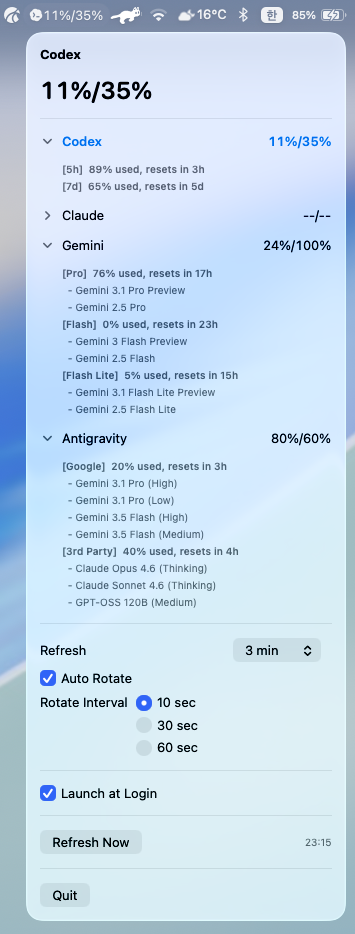
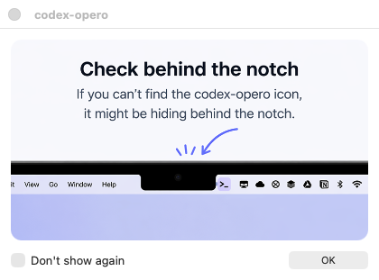
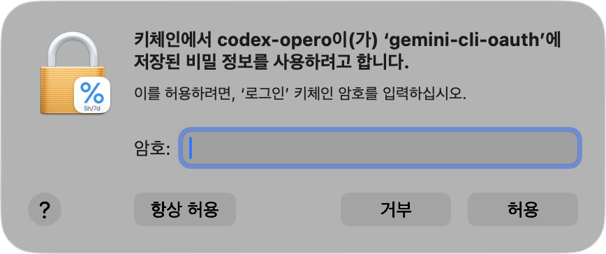

[English](./README.md) | [한국어](./README.ko.md)

# codex-opero

`codex-opero`는 macOS 메뉴 막대에서 AI 사용량을 `57%/90%`처럼 바로 보여주는 작은 앱입니다.  
복잡한 대시보드 대신, 지금 필요한 숫자만 빠르게 확인하는 데 초점을 두었습니다.

<table width="100%">
  <tr>
    <td width="50%" valign="top"></td>
    <td width="50%" valign="top"></td>
  </tr>
  <tr>
    <td width="50%" valign="top"></td>
    <td width="50%" valign="top"></td>
  </tr>
</table>

## 핵심 기능

- 메뉴 막대에 선택된 provider의 남은 사용량을 두 칸 숫자 형식으로 간단히 표시합니다
- `Codex`, `Claude`, `Gemini`, `Antigravity` 중 하나를 선택해서 메뉴 막대에 띄울 수 있습니다
- 마지막으로 선택한 provider를 기억합니다
- `Auto Rotate`를 켜면 사용 가능한 provider를 설정한 간격으로 자동 순환합니다
- 메뉴에서 refresh 간격을 프리셋으로 선택할 수 있습니다
- 메뉴에서 auto rotate 간격을 프리셋으로 선택할 수 있습니다
- 설정한 간격으로 자동 새로고침하며, `Refresh Now`도 지원합니다
- 중요한 사용량 구간이 다시 `100%`가 되면 macOS 알림으로 알려줍니다
- 약 일주일에 한 번 GitHub 릴리즈 업데이트를 확인합니다
- 패키징된 `.app`에서는 `Launch at Login` 토글을 사용할 수 있습니다
- 조회에 실패하면 `--/--`로 표시합니다

## 인증 방식

이 앱은 별도 로그인 UI나 OAuth 화면을 만들지 않습니다.  
대신 이미 로컬에 저장된 인증 상태를 재사용해 usage만 조회합니다.

- `Codex`: `~/.codex/auth.json` 사용
- `Claude`: macOS Keychain의 `Claude Code-credentials` 또는 `~/.claude/.credentials.json` 사용
- `Gemini`: macOS Keychain의 `gemini-cli-oauth` 또는 `~/.gemini/oauth_creds.json` 사용
- `Antigravity` (agy): 로컬 `agy` CLI를 실행해 `/usage` 화면을 열고, 그 live quota 출력을 파싱합니다. 기존 Antigravity 로그인/keyring 상태가 필요합니다

즉, 이 앱은 이미 로그인된 상태를 활용하므로 Codex, Claude, Gemini, 또는 Antigravity에 로그인 되어 있어야 합니다.

`Gemini`의 경우 메뉴 막대의 두 칸 숫자는 Codex/Claude의 `5시간 / 주간` 구조와 동일하지 않고, 대표적인 `Pro / Flash` quota 구간을 기준으로 표시합니다.  
메뉴를 열면 Gemini 사용량은 `Pro`, `Flash`, `Flash Lite` 모델 그룹별로 더 자세히 표시됩니다.

`Antigravity`의 경우 메뉴 막대의 두 칸 숫자는 공유 quota bucket을 기준으로 표시합니다.

- `Google`: Gemini 3.1 Pro 및 Gemini 3.5 Flash 계열
- `3rd Party`: Claude Opus/Sonnet 및 GPT-OSS 계열

Antigravity의 로컬 JSON quota cache는 실제 CLI 화면보다 늦게 갱신될 수 있기 때문에, `codex-opero`는 Antigravity 사용량을 조회할 때 `agy /usage` live 출력을 우선 사용합니다.

`Claude` 또는 `Gemini`를 사용하는 경우, 앱이 처음 Keychain 자격증명에 접근할 때 macOS가 암호를 물어볼 수 있습니다.  
이 팝업은 **사용자가 해당 AI 도구를 로그인하여 사용하고 있으며, 관련 키체인이 존재할 때만 1회** 나타납니다. (해당 AI 도구를 전혀 사용하지 않거나 로그인한 적이 없는 경우 팝업은 전혀 발생하지 않고 자동으로 스킵됩니다.)  

`codex-opero`는 일정 간격으로 새로고침하므로, 팝업창이 뜰 때 `허용` 대신 **`항상 허용(Always Allow)`**을 선택하셔야 이후 비밀번호 요구 없이 백그라운드에서 매끄럽게 조회됩니다.

<p>
  
</p>

이 대화상자가 뜨면 **`항상 허용`**을 선택하세요. 그래야 `codex-opero`가 백그라운드에서 사용량을 새로고침할 때마다 비밀번호를 다시 묻지 않습니다.

## 알림

`codex-opero`는 사용량이 다시 회복되었을 때 macOS 알림으로 알려줄 수 있습니다.

- `Codex`, `Claude`: `5h` 또는 `7d` 남은 사용량이 `100%`로 돌아오면 알림을 보냅니다
- `Gemini`: 대표 `Pro` 또는 `Flash` quota 구간이 `100%`로 돌아오면 알림을 보냅니다

각 구간은 `100%` 상태가 유지되는 동안 한 번만 알림을 보냅니다.  
사용량이 `100%` 아래로 내려갔다가 다시 `100%`로 돌아오면 다시 알림을 보낼 수 있습니다.

또한 약 일주일에 한 번 GitHub Releases를 확인합니다.  
새 버전이 있으면 릴리즈 페이지를 브라우저로 열지 묻는 팝업을 표시합니다.

## Auto Rotate

`Auto Rotate`는 기본값이 꺼져 있습니다.  
켜면 아래 순서대로 사용 가능한 provider를 자동 순환합니다.

- `Codex`
- `Claude`
- `Gemini`
- `Antigravity`

refresh 간격은 `1분`, `3분`, `5분`, `15분` 같은 프리셋 중에서 고를 수 있습니다.  
auto rotate 간격도 `10초`, `30초`, `60초` 같은 프리셋 중에서 고를 수 있습니다.

현재 `--/--`로 표시되는 조회 실패 provider는 자동으로 건너뜁니다.  
메뉴가 열려 있는 동안에는 순환이 잠시 멈추고, 메뉴를 닫으면 다시 이어집니다.  
새로고침 중에는 마지막 성공 스냅샷을 계속 보여주고, 실제로 refresh가 실패한 경우에만 `--/--`로 fallback합니다.

## 릴리즈에서 설치

일반 사용자는 GitHub 릴리즈에서 `.dmg`를 내려받아 설치하는 방식이 가장 편합니다.

1. [Releases](https://github.com/charliehotel/codex-opero/releases)에서 최신 `.dmg`를 다운로드합니다
2. `.dmg`를 엽니다
3. `codex-opero.app`를 `Applications` 폴더로 드래그합니다
4. `Applications` 폴더에서 `codex-opero.app`를 실행합니다

## macOS가 실행을 막을 때

현재 배포되는 `codex-opero`는 unsigned 앱입니다.  
macOS가 실행을 막으면 아래 방법 중 하나를 사용하실 수 있습니다.
(이 방법은 직접 빌드했거나, 출처를 신뢰할 수 있는 앱에만 사용하시는 것을 권장드립니다.)

### 방법 1. Finder에서 열기

1. `codex-opero.app`를 우클릭합니다.
2. `열기`를 선택합니다.
3. 경고가 나오면 다시 한 번 `열기`를 선택합니다.

### 방법 2. quarantine 속성 제거

```bash
xattr -dr com.apple.quarantine /Applications/codex-opero.app
open /Applications/codex-opero.app
```

## 소스에서 빠르게 실행

```bash
git clone https://github.com/charliehotel/codex-opero.git
cd codex-opero
swift run codex-opero
```

macOS 환경과 로컬의 기존 Codex, Claude, Gemini, 또는 Antigravity 로그인 상태가 필요합니다.

## 릴리즈 노트

<details>
  <summary>v0.1.91</summary>
  <ul>
    <li><code>agy /usage</code>가 터미널 화면 갱신 escape sequence로 quota를 출력할 때 Antigravity live usage 파싱이 실패하던 문제 수정</li>
  </ul>
</details>

<details>
  <summary>v0.1.9</summary>
  <ul>
    <li>Antigravity 사용량 조회를 오래된 quota cache 파일 대신 live <code>agy /usage</code> 출력 우선 방식으로 변경</li>
    <li>Antigravity 사용량을 실제 공유 quota 구조에 맞춰 <code>Google</code>과 <code>3rd Party</code> 두 bucket으로 표시</li>
    <li>각 Antigravity bucket 아래에 Gemini 3.1 Pro, Gemini 3.5 Flash, Claude Opus/Sonnet 4.6, GPT-OSS 120B 등 선택 가능한 모델 목록 표시</li>
    <li>Antigravity live 조회 실패를 낡은 100% cache 값으로 조용히 숨기지 않고 오류로 드러나게 수정</li>
    <li>provider별 상세 영역을 접고 펼칠 수 있게 하고, 접힘/펼침 상태를 앱 재시작 후에도 유지</li>
    <li>Codex, Claude, Gemini, Antigravity의 상세 bucket 표시 형식을 통일</li>
    <li>Gemini 상세 그룹을 현재 Pro, Flash, Flash Lite 모델군에 맞게 업데이트</li>
    <li>Antigravity live usage 파싱, 현재 계정 cache 선택, 접힘 상태 저장에 대한 테스트 보강</li>
  </ul>
</details>

<details>
  <summary>v0.1.8</summary>
  <ul>
    <li>Antigravity(agy) CLI 사용량을 독립 탭으로 추가</li>
    <li><code>~/.antigravity_cockpit/cache/quota_api_v1/authorized/</code> 캐시 파일을 직접 읽어 키체인 승인 없이 사용량 표시</li>
    <li>모델 그룹을 제공사(Google / Anthropic / OpenAI) 기준으로 분류하여 상세 메뉴에 표시</li>
    <li>총 4탭 지원: <code>Codex</code> / <code>Claude</code> / <code>Gemini</code> / <code>Antigravity</code></li>
  </ul>
</details>

<details>
  <summary>v0.1.7</summary>
  <ul>
    <li>Antigravity CLI 및 최신 Gemini CLI와의 연동 호환성 개선</li>
    <li>로컬 파일(<code>oauth_creds.json</code>)이 없는 경우 macOS 키체인(<code>gemini-cli-oauth</code>)에서 자동으로 토큰 정보를 검색하여 가져오는 기능 추가</li>
    <li>Gemini CLI 삭제 시의 OAuth 클라이언트 정보 폴백 처리 추가</li>
  </ul>
</details>

<details>
  <summary>v0.1.6</summary>
  <ul>
    <li>Codex와 Claude의 <code>5h</code>, <code>7d</code> 사용량 reset 알림 추가</li>
    <li>Gemini의 <code>Pro</code>, <code>Flash</code> quota 구간 reset 알림 추가</li>
    <li>메뉴에서 Gemini의 세부 모델별 개별 사용량을 <code>Pro</code>, <code>Flash</code>, <code>Flash Lite</code> 그룹으로 나누어 표시</li>
    <li>일주일 단위 GitHub 릴리즈 업데이트 확인 및 브라우저 열기 팝업 추가</li>
    <li>메뉴를 열지 않아도 reset 알림이 동작하도록 앱 실행 시 usage refresh 시작</li>
    <li>메뉴에서 불필요한 refresh-rate 안내 문구 삭제</li>
  </ul>
</details>

<details>
  <summary>v0.1.5</summary>
  <ul>
    <li>최근 Gemini CLI 업데이트 이후 Gemini 사용량 조회가 실패하던 문제 수정</li>
    <li>최신 Gemini CLI 번들 구조에 맞게 Gemini OAuth 소스 탐색 로직 개선</li>
  </ul>
</details>

<details>
  <summary>v0.1.4</summary>
  <ul>
    <li>첫 실행 시 노치 안내 이미지를 포함한 온보딩 팝업 추가</li>
    <li><code>Don't show again</code> 체크박스와 작은 <code>OK</code> 버튼 추가</li>
    <li>팝업 안내 이미지를 패키징된 앱 안에 함께 포함</li>
  </ul>
</details>

<details>
  <summary>v0.1.3</summary>
  <ul>
    <li>refresh 간격 프리셋 설정 추가</li>
    <li>auto rotate 간격 프리셋 설정 추가</li>
    <li>새로고침 중 마지막 성공 스냅샷을 유지해 fallback 깜빡임 완화</li>
    <li><code>resets in 4h</code> 같은 영어 고정 compact reset 문구 적용</li>
  </ul>
</details>

<details>
  <summary>v0.1.2</summary>
  <ul>
    <li>Codex, Claude, Gemini provider tray icon 추가</li>
    <li>메뉴 안의 30초 Auto Rotate 기능 추가</li>
    <li>새로고침 중 이전 성공 스냅샷을 유지하도록 개선</li>
  </ul>
</details>

<details>
  <summary>v0.1.1</summary>
  <ul>
    <li>Gemini provider 지원 추가</li>
    <li>앱 아이콘을 패키징된 <code>.app</code>과 DMG에 포함</li>
    <li>Codex와 Claude 사용량 지원 유지</li>
  </ul>
</details>

<details>
  <summary>v0.1.0</summary>
  <ul>
    <li>최초 공개 버전</li>
    <li>Codex와 Claude 사용량을 보여주는 최소한의 macOS 메뉴 막대 앱</li>
    <li>기본 DMG 배포 및 unsigned 앱 실행 안내 포함</li>
  </ul>
</details>
