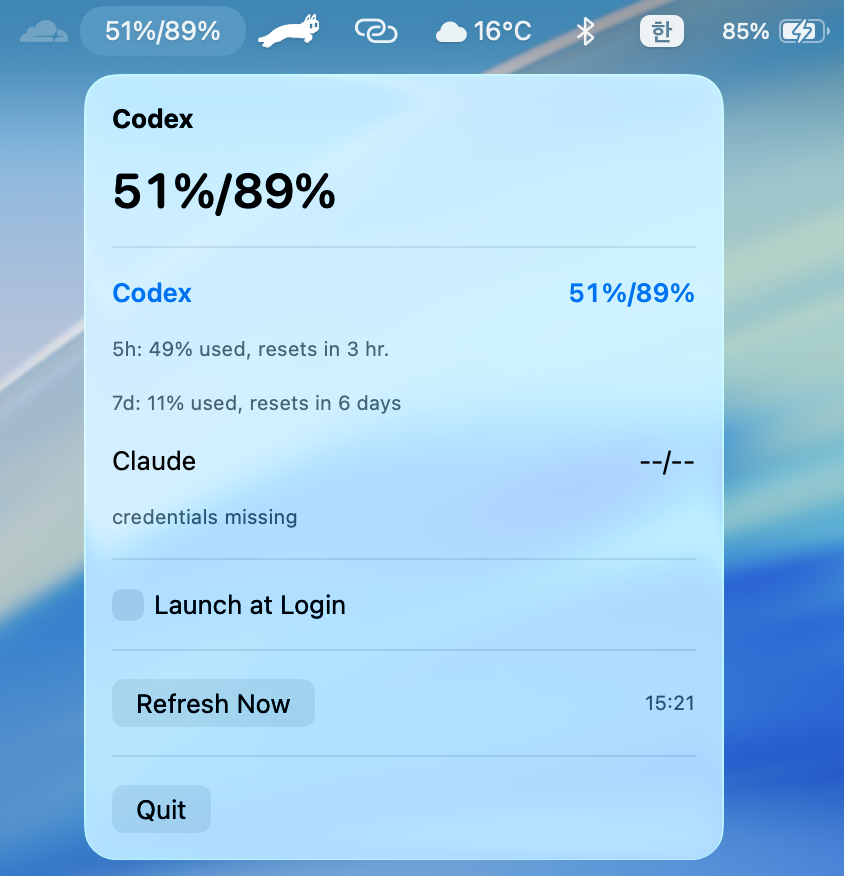

# codex-opero

`codex-opero`는 macOS 메뉴 막대에서 AI 사용량을 `57%/90%`처럼 바로 보여주는 작은 앱입니다.  
복잡한 대시보드 대신, 지금 필요한 숫자만 빠르게 확인하는 데 초점을 두었습니다.



## 핵심 기능

- 메뉴 막대에 선택된 provider의 남은 사용량을 `5시간/주간` 형식으로 표시합니다
- `Codex`, `Claude` 중 하나를 선택해서 메뉴 막대에 띄울 수 있습니다
- 마지막으로 선택한 provider를 기억합니다
- 1분마다 자동 새로고침하며, `Refresh Now`도 지원합니다
- 패키징된 `.app`에서는 `Launch at Login` 토글을 사용할 수 있습니다
- 조회에 실패하면 `--/--`로 표시합니다

## 인증 방식

이 앱은 별도 로그인 UI나 OAuth 화면을 만들지 않습니다.  
대신 이미 로컬에 저장된 인증 상태를 재사용해 usage만 조회합니다.

- `Codex`: `~/.codex/auth.json` 사용
- `Claude`: macOS Keychain의 `Claude Code-credentials` 또는 `~/.claude/.credentials.json` 사용

즉, 이 앱은 이미 로그인된 상태를 활용하므로 Codex 또는 Claude에 로그인 되어 있어야 합니다.

## 실행 방법

### CLI 확인

```bash
cd /path/to/codex-opero
swift run codex-opero-cli
```

예시:

```text
Codex: 80%/94%
Claude: --/-- (credentials missing)
```

### 메뉴 막대 앱 실행

```bash
cd /path/to/codex-opero
swift run codex-opero
```

### `.app` 만들기

```bash
cd /path/to/codex-opero
chmod +x Scripts/package_app.sh
./Scripts/package_app.sh
open /path/to/codex-opero/codex-opero.app
```

스크립트는 `dist/codex-opero.dmg`도 함께 생성합니다.

## unsigned `.app` 테스트

현재 생성되는 `.app`는 unsigned 개발용 빌드입니다.  
테스트 시 macOS가 실행을 막으면 아래 방법 중 하나를 사용하실 수 있습니다.
(이 방법은 직접 빌드했거나, 출처를 신뢰할 수 있는 앱에만 사용하시는 것을 권장드립니다.)

### 방법 1. Finder에서 열기

1. `codex-opero.app`를 우클릭합니다.
2. `열기`를 선택합니다.
3. 경고가 나오면 다시 한 번 `열기`를 선택합니다.

### 방법 2. quarantine 속성 제거

```bash
xattr -dr com.apple.quarantine /path/to/codex-opero.app
open /path/to/codex-opero.app
```
