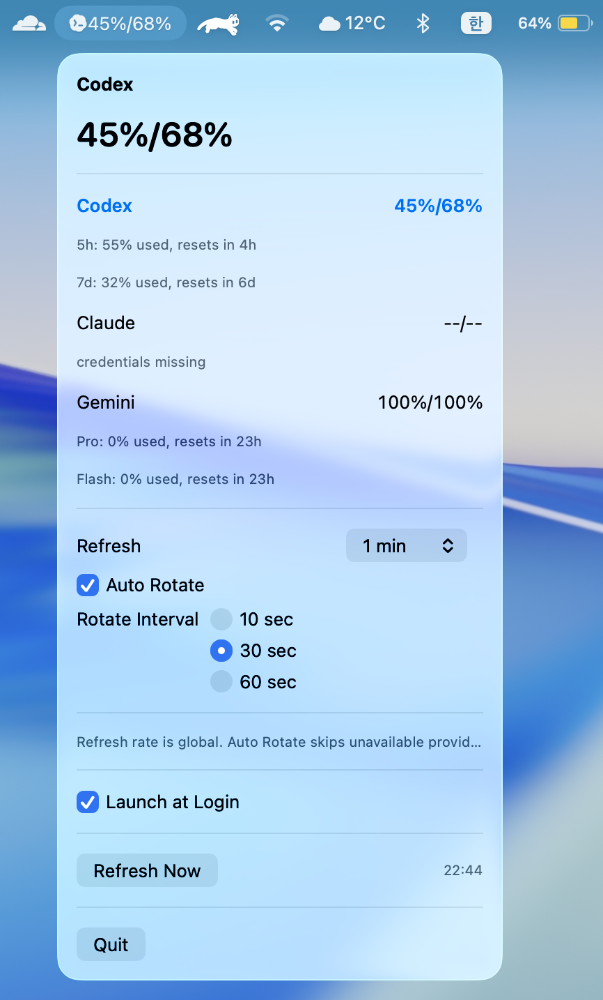

[English](./README.md) | [한국어](./README.ko.md)

# codex-opero

`codex-opero` is a minimal macOS menu bar app that shows AI usage as a compact string like `57%/90%`.  
Instead of a full dashboard, it focuses on one thing: letting you check the numbers you need at a glance.

<p align="center">
  
</p>

<p align="center">
  
</p>

## Highlights

- Shows the selected provider's remaining usage in a compact two-value format from the menu bar
- Lets you choose between `Codex`, `Claude`, and `Gemini`
- Remembers the last selected provider
- Supports `Auto Rotate` to cycle through available providers at a configurable interval
- Lets you choose the refresh interval from preset options in the menu
- Lets you choose the auto-rotate interval from preset options in the menu
- Refreshes automatically at the configured interval and also supports `Refresh Now`
- Supports `Launch at Login` when running as a packaged `.app`
- Falls back to `--/--` when usage lookup fails

## Authentication

This app does not provide its own login UI or OAuth flow.  
Instead, it reuses existing local authentication state and only fetches usage.

- `Codex`: uses `~/.codex/auth.json`
- `Claude`: uses the macOS Keychain item `Claude Code-credentials` or `~/.claude/.credentials.json`
- `Gemini`: uses `~/.gemini/oauth_creds.json` and Gemini Code Assist quota endpoints

That means Codex, Claude, or Gemini must already be logged in on the local machine.

For `Gemini`, the two displayed values currently map to representative `Pro / Flash` quota buckets rather than the same `5-hour / weekly` windows used by Codex and Claude.

If you use `Claude`, macOS may ask for your password when the app first tries to read the Keychain credential.  
Because `codex-opero` refreshes on a recurring interval, choosing `Allow` can cause repeated prompts.  
To avoid that, choose `Always Allow` for `codex-opero` when macOS asks for access to the Claude credential.

## Auto Rotate

`Auto Rotate` is off by default.  
When enabled, `codex-opero` rotates through available providers in this order:

- `Codex`
- `Claude`
- `Gemini`

You can choose the refresh interval from preset options such as `1 min`, `3 min`, `5 min`, and `15 min`.  
You can also choose the auto-rotate interval from preset options such as `10 sec`, `30 sec`, and `60 sec`.

Providers that are currently unavailable and showing `--/--` are skipped automatically.  
If the menu is open, rotation pauses until the menu closes.  
During refresh, the app keeps showing the last successful snapshot and only falls back to `--/--` if a provider refresh actually fails.

## Install from Release

The easiest way to use `codex-opero` is from the GitHub release.

1. Download the latest `.dmg` from [Releases](https://github.com/charliehotel/codex-opero/releases)
2. Open the `.dmg`
3. Drag `codex-opero.app` into the `Applications` folder
4. Launch `codex-opero.app` from `Applications`

## If macOS blocks the app

`codex-opero` is currently distributed as an unsigned app.  
If macOS blocks it, use one of the following methods.  
Only do this for builds you trust.

### Option 1. Open from Finder

1. Right-click `codex-opero.app`
2. Select `Open`
3. If macOS shows a warning, choose `Open` again

### Option 2. Remove quarantine

```bash
xattr -dr com.apple.quarantine /Applications/codex-opero.app
open /Applications/codex-opero.app
```

## Quick Start from Source

```bash
git clone https://github.com/charliehotel/codex-opero.git
cd codex-opero
swift run codex-opero
```

Requires macOS and an existing Codex, Claude, or Gemini login on the local machine.

## Screenshot History

- [v0.1.0](./Screenshot_v0.1.0.png)
- [v0.1.1](./Screenshot_v0.1.1.png)
- [v0.1.2](./Screenshot_v0.1.2.png)
- [v0.1.3](./Screenshot_v0.1.3.png)
- [v0.1.4](./Screenshot_v0.1.4.png)
