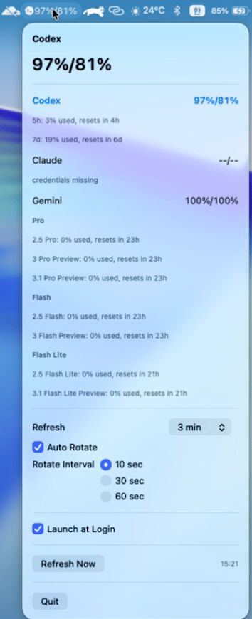

[English](./README.md) | [한국어](./README.ko.md)

# codex-opero

`codex-opero` is a minimal macOS menu bar app that shows AI usage as a compact string like `57%/90%`.  
Instead of a full dashboard, it focuses on one thing: letting you check the numbers you need at a glance.

<table>
  <tr>
    <td></td>
    <td></td>
  </tr>
  <tr>
    <td></td>
    <td></td>
  </tr>
</table>

## Highlights

- Shows the selected provider's remaining usage in a compact two-value format from the menu bar
- Lets you choose between `Codex`, `Claude`, and `Gemini`
- Remembers the last selected provider
- Supports `Auto Rotate` to cycle through available providers at a configurable interval
- Lets you choose the refresh interval from preset options in the menu
- Lets you choose the auto-rotate interval from preset options in the menu
- Refreshes automatically at the configured interval and also supports `Refresh Now`
- Sends reset notifications when important usage buckets return to 100%
- Checks for new GitHub releases about once a week
- Supports `Launch at Login` when running as a packaged `.app`
- Falls back to `--/--` when usage lookup fails

## Authentication

This app does not provide its own login UI or OAuth flow.  
Instead, it reuses existing local authentication state and only fetches usage.

- `Codex`: uses `~/.codex/auth.json`
- `Claude`: uses the macOS Keychain item `Claude Code-credentials` or `~/.claude/.credentials.json`
- `Gemini`: uses `~/.gemini/oauth_creds.json` and Gemini Code Assist quota endpoints

That means Codex, Claude, or Gemini must already be logged in on the local machine.

For `Gemini`, the two menu bar values currently map to representative `Pro / Flash` quota buckets rather than the same `5-hour / weekly` windows used by Codex and Claude.  
When you open the menu, Gemini usage is shown in more detail by `Pro`, `Flash`, and `Flash Lite` model groups.

If you use `Claude`, macOS may ask for your password when the app first tries to read the Keychain credential.  
Because `codex-opero` refreshes on a recurring interval, choosing `Allow` can cause repeated prompts.  
To avoid that, choose `Always Allow` for `codex-opero` when macOS asks for access to the Claude credential.

## Notifications

`codex-opero` can send macOS notifications when usage becomes available again.

- `Codex` and `Claude`: notifies when the `5h` or `7d` remaining usage returns to `100%`
- `Gemini`: notifies when the representative `Pro` or `Flash` usage bucket returns to `100%`

Each bucket is notified only once while it stays at `100%`.  
It can notify again after usage drops below `100%` and later returns to `100%`.

The app also checks GitHub Releases about once a week.  
If a newer version is available, it asks whether you want to open the release page in your browser.

## Auto Rotate

`Auto Rotate` is off by default.  
When enabled, `codex-opero` rotates through available providers in this order:

- `Codex`
- `Claude`
- `Gemini`

You can choose the refresh interval from preset options such as `1 min`, `3 min`, `5 min`, and `15 min`.  
You can also choose the auto-rotate interval from preset options such as `10 sec`, `30 sec`, and `60 sec`.

Providers that are currently unavailable and showing `--/--` are skipped automatically.  
If the menu is open, rotation pauses until the menu closes.  
During refresh, the app keeps showing the last successful snapshot and only falls back to `--/--` if a provider refresh actually fails.

## Install from Release

The easiest way to use `codex-opero` is from the GitHub release.

1. Download the latest `.dmg` from [Releases](https://github.com/charliehotel/codex-opero/releases)
2. Open the `.dmg`
3. Drag `codex-opero.app` into the `Applications` folder
4. Launch `codex-opero.app` from `Applications`

## If macOS blocks the app

`codex-opero` is currently distributed as an unsigned app.  
If macOS blocks it, use one of the following methods.  
Only do this for builds you trust.

### Option 1. Open from Finder

1. Right-click `codex-opero.app`
2. Select `Open`
3. If macOS shows a warning, choose `Open` again

### Option 2. Remove quarantine

```bash
xattr -dr com.apple.quarantine /Applications/codex-opero.app
open /Applications/codex-opero.app
```

## Quick Start from Source

```bash
git clone https://github.com/charliehotel/codex-opero.git
cd codex-opero
swift run codex-opero
```

Requires macOS and an existing Codex, Claude, or Gemini login on the local machine.

## Screenshot History

- [v0.1.0](./Screenshot_v0.1.0.png)
- [v0.1.1](./Screenshot_v0.1.1.png)
- [v0.1.2](./Screenshot_v0.1.2.png)
- [v0.1.3](./Screenshot_v0.1.3.png)
- [v0.1.4](./Screenshot_v0.1.4.png)

## Release Notes

<details>
  <summary>v0.1.6</summary>
  <ul>
    <li>Add reset notifications for Codex and Claude <code>5h</code> and <code>7d</code> usage windows</li>
    <li>Add reset notifications for Gemini <code>Pro</code> and <code>Flash</code> quota buckets</li>
    <li>Show individual Gemini model usage in the menu, grouped by <code>Pro</code>, <code>Flash</code>, and <code>Flash Lite</code></li>
    <li>Add a weekly GitHub release update check with a browser-open prompt</li>
    <li>Start usage refresh at app launch so reset notifications can fire without opening the menu</li>
    <li>Remove the extra refresh-rate helper text from the menu</li>
  </ul>
</details>

<details>
  <summary>v0.1.5</summary>
  <ul>
    <li>Fix Gemini usage lookup after recent Gemini CLI updates</li>
    <li>Improve Gemini OAuth source discovery for newer Gemini CLI bundle layouts</li>
  </ul>
</details>

<details>
  <summary>v0.1.4</summary>
  <ul>
    <li>Add a first-run onboarding popup with a notch guidance image</li>
    <li>Add a <code>Don't show again</code> checkbox and compact <code>OK</code> button</li>
    <li>Bundle the popup guidance image inside the packaged app</li>
  </ul>
</details>

<details>
  <summary>v0.1.3</summary>
  <ul>
    <li>Add configurable refresh interval presets</li>
    <li>Add configurable auto-rotate interval presets</li>
    <li>Keep the last successful snapshot visible during refresh to reduce fallback flicker</li>
    <li>Use fixed English compact reset text such as <code>resets in 4h</code></li>
  </ul>
</details>

<details>
  <summary>v0.1.2</summary>
  <ul>
    <li>Add provider tray icons for Codex, Claude, and Gemini</li>
    <li>Add Auto Rotate in the menu with 30-second rotation across available providers</li>
    <li>Keep previous successful usage snapshots visible during refresh to reduce flicker</li>
  </ul>
</details>

<details>
  <summary>v0.1.1</summary>
  <ul>
    <li>Add Gemini provider support</li>
    <li>Include the app icon in the packaged <code>.app</code> and DMG release</li>
    <li>Keep Codex and Claude usage support</li>
  </ul>
</details>

<details>
  <summary>v0.1.0</summary>
  <ul>
    <li>Initial public release</li>
    <li>Minimal macOS menu bar app for Codex and Claude usage</li>
    <li>Basic DMG distribution and unsigned app installation guidance</li>
  </ul>
</details>
